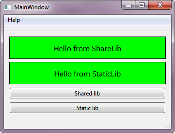

# TemplateQtSolution

Template for Qt progect which is used libraries;

| Name | Description
| ------ |------ |
| **bin** | binaries |
| **buil** | intermediate files of building (moc, obj etc)  |
| **import**| extern binaries |
| **include** | common header files |
| **src** | sources and subproject files |

---
Examples below

Fig1. Example1

